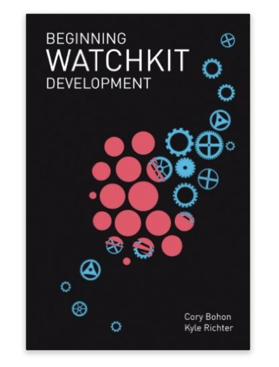

 

# Beginning WatchKit Development
Sample code for the [Beginning WatchKit Development book](http://watchkitbook.com) by Cory Bohon and Kyle Richter

# About the Book
Whether new to iOS development, or a current professional developer, _Beginning WatchKit Development_ shows you how to level up your app. 

Turn to _Beginning WatchKit Development_ and quickly build your skills, developing polished watchOS apps. With this book, you'll learn how to add cool features to your apps like local networking bteween watchOS and iOS with the WatchConnectivity Framework, multimedia functionality to play audio and video content, and you'll also learn how to: 

- Build your first watchOS app from start to finish
- Add multimedia components like audio and video playback
- Record high quality audio from the built-in microphones
- Access health data, including live heart rate data
- Implement Handoff so users can continue tasks started on watchOS
- Gather user input for use in apps
- Add ClockKit complications to the watch face

Each chapter will guide you through building a sample app piece by piece. By following along with the sample code throughout the book from start to finish, you'll gain firsthand knowledge on the process of creating a fully functional watchOS app. Authors Cory Bohon and Kyle Richter will help you avoid the common pitfalls encountered when building your first watchOS app.
